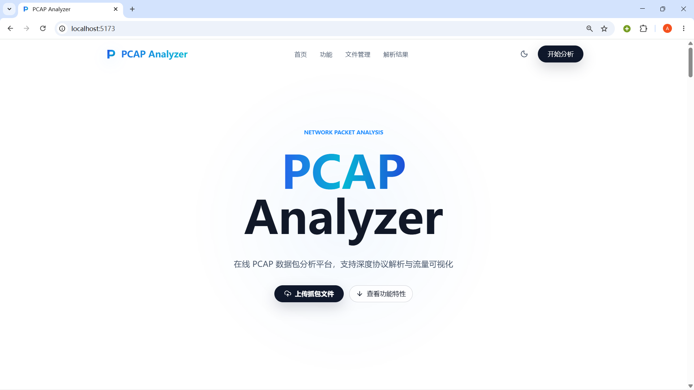
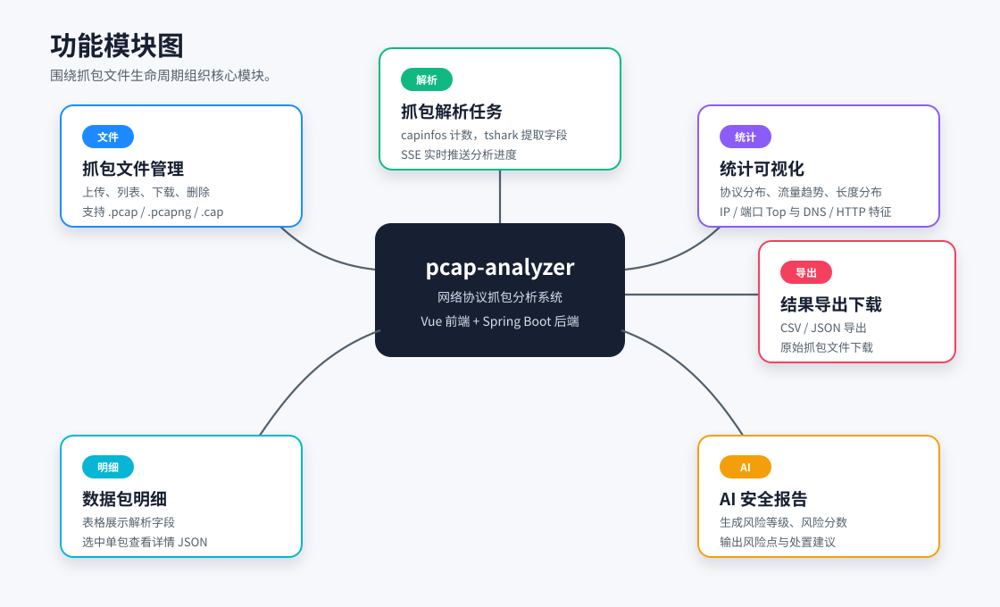
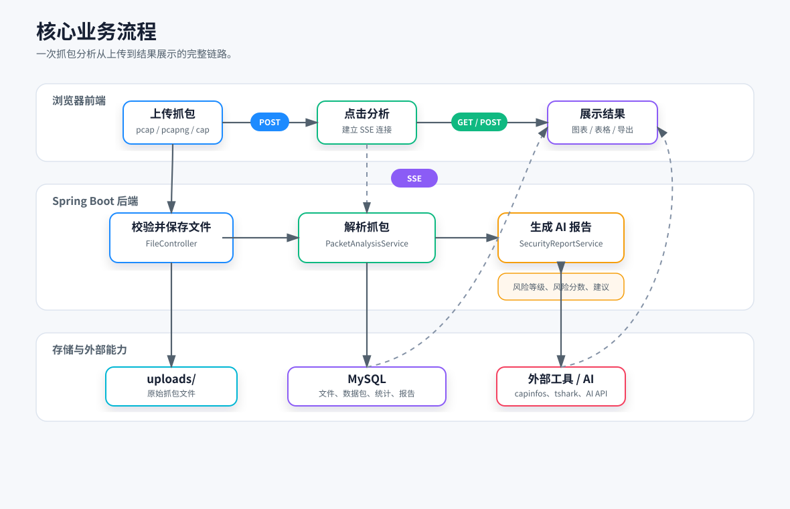
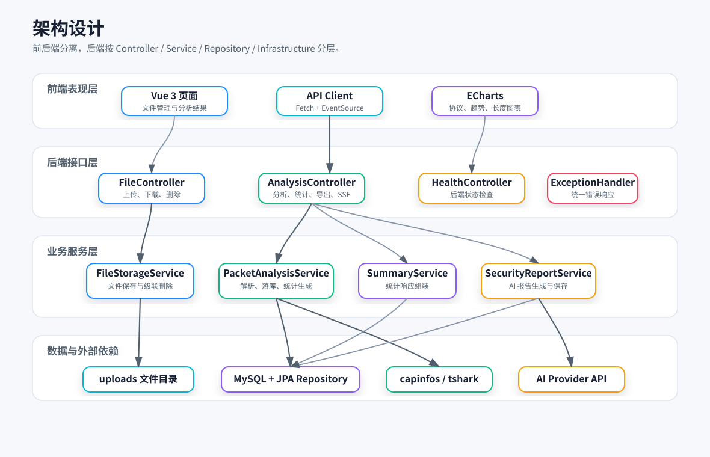
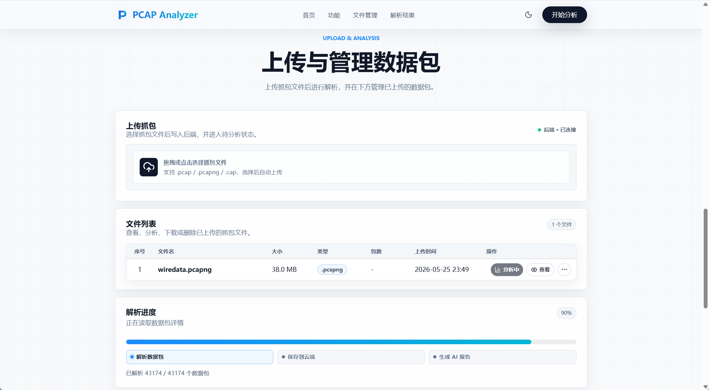
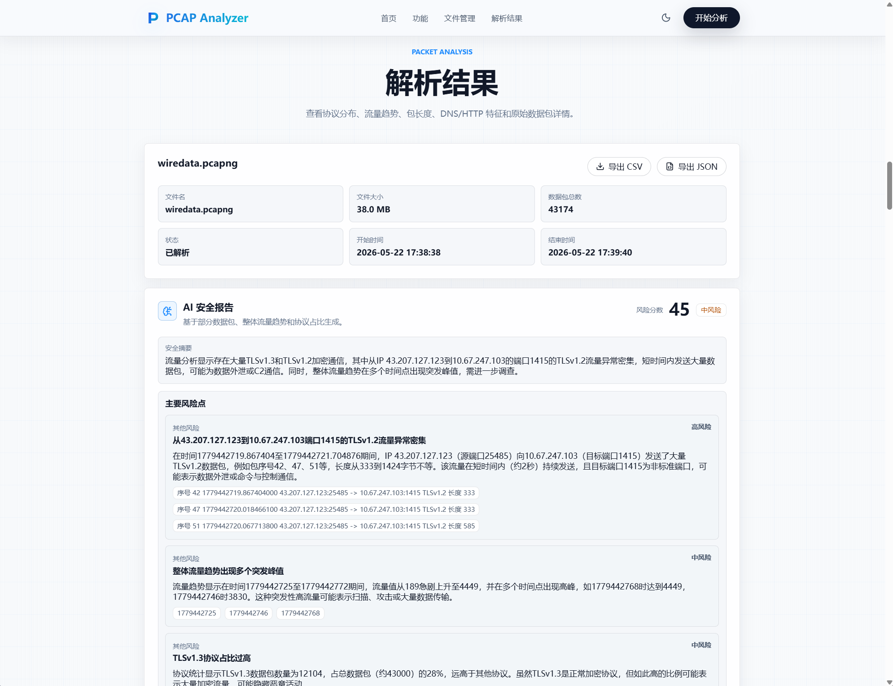
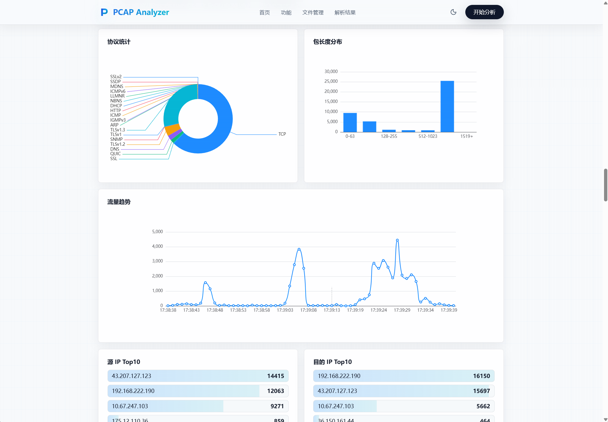
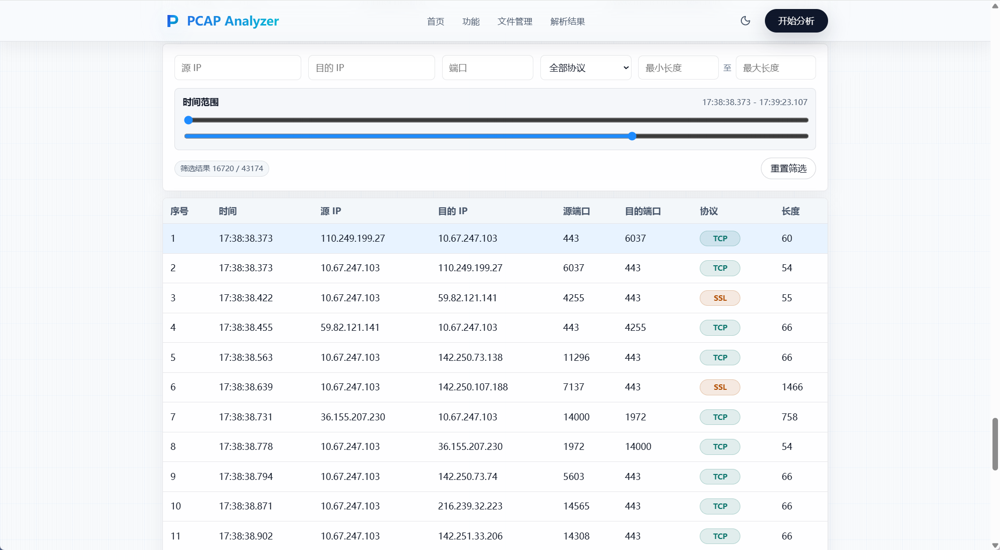
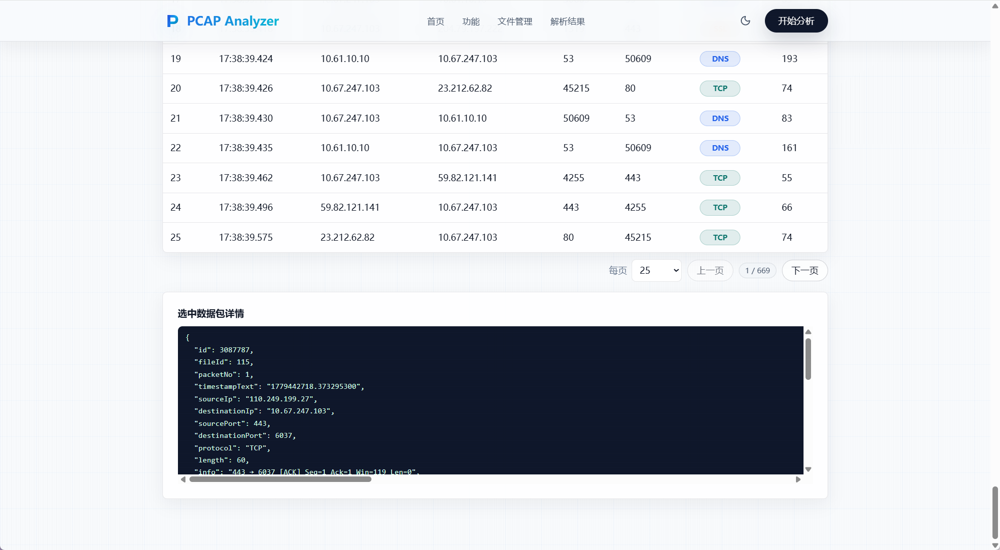

# pcap-analyzer

在线 pcap 数据包分析网站

支持 `.pcap`、`.pcapng`、`.cap` 格式，解析数据包并展示统计图表、明细和 AI 安全报告



## 功能概览



文件管理、解析执行、统计展示、安全报告、导出下载

## 业务流程



1. 上传抓包文件，后端保存到 `uploads/`
2. 写入 `CaptureFile` 元数据，状态为 `uploaded`
3. 点击分析，前端通过 SSE 接收进度
4. `PacketAnalysisService` 调用 `capinfos` / `tshark`
5. 批量保存 `PacketRecord`，生成 `AnalysisSummary`
6. `SecurityReportService` 读取统计和部分数据包样本，生成 AI 报告
7. 前端展示图表、表格、详情和导出入口

## 架构设计



- 前端：Vue 页面、REST 请求、SSE、ECharts 图表
- 接口层：健康检查、文件管理、分析进度、统计、报告、导出
- 服务层：文件存储、抓包解析、统计生成、AI 报告
- 基础设施：`capinfos` / `tshark` 命令执行、AI HTTP 调用
- 数据层：MySQL 保存文件、数据包、统计、AI 报告，`uploads/` 保存原始文件

## 项目结构

```text
pcap-analyzer/
├── assets/                         # README 展示用架构图和页面截图
├── frontend/                       # Vue 3 + Vite 前端项目
│   ├── public/                     # favicon、图标等静态资源
│   ├── scripts/                    # 前端交互检查脚本
│   └── src/
│       ├── api/                    # REST 与 SSE 请求封装
│       ├── components/             # 上传、表格、图表、安全报告等组件
│       ├── views/                  # 文件管理页和分析结果页
│       ├── App.vue                 # 单页工作台入口
│       └── main.js                 # 前端启动入口
├── samples/                        # 示例抓包文件
├── sql/                            # 数据库初始化脚本
├── src/
│   ├── main/
│   │   ├── java/com/hzcu/pcap/
│   │   │   ├── config/             # AI 提供商配置
│   │   │   ├── controller/         # 文件、分析、健康检查接口
│   │   │   ├── dto/                # 进度事件和 AI 报告响应结构
│   │   │   ├── entity/             # JPA 实体
│   │   │   ├── repository/         # Spring Data JPA 仓储
│   │   │   └── service/            # 存储、解析、统计、AI 报告服务
│   │   └── resources/              # Spring Boot 配置
│   └── test/                       # 后端单元测试和控制器测试
├── Dockerfile                      # 前后端打包与运行镜像
├── compose.yaml                    # Spring Boot + MySQL 一键启动配置
├── pom.xml                         # Maven 后端依赖与构建配置
└── README.md                       # 项目说明文档
```

## 快速开始

### 使用 Docker

#### Building and running the application

一行命令即可快速开始：

```bash
docker compose up --build
```

这会启动：

- `server`: Spring Boot 镜像, vue 前端和 `tshark`/`capinfos`
- `db`: MySQL 8.0 服务, 数据持久化在 `mysql-data` 卷

应用访问地址：

```text
http://localhost:8080
```

#### AI configuration

AI 默认不启用，没有 api key 也可以正常运行

启用 ai 报告：

```bash
AI_ENABLED=true AI_API_KEY=<your-key> docker compose up --build
```

### 手动运行

#### 环境要求

- JDK 25
- Node.js 与 npm
- MySQL
- `tshark`、`capinfos`

#### MySQL 初始化

```bash
mysql --protocol=tcp --host=127.0.0.1 --user=root --password=mysql123123 < sql/init.sql
```

默认配置在 `src/main/resources/application.yml`

```yaml
spring:
  datasource:
    url: ${MYSQL_URL:jdbc:mysql://localhost:3306/pcap_analyzer?useUnicode=true&characterEncoding=utf8&serverTimezone=Asia/Shanghai&rewriteBatchedStatements=true}
    username: ${MYSQL_USERNAME:root}
    password: ${MYSQL_PASSWORD:mysql123123}
```

可用环境变量覆盖

```bash
MYSQL_URL=jdbc:mysql://localhost:3306/pcap_analyzer
MYSQL_USERNAME=root
MYSQL_PASSWORD=mysql123123
```

#### AI 配置

默认配置

```yaml
ai:
  provider:
    enabled: ${AI_ENABLED:true}
    provider: ${AI_PROVIDER:deepseek}
    api-key: ${AI_API_KEY:}
    model: ${AI_MODEL:deepseek-v4-flash}
    base-url: ${AI_BASE_URL:https://api.deepseek.com}
    chat-completions-path: ${AI_CHAT_COMPLETIONS_PATH:/chat/completions}
    timeout-seconds: ${AI_TIMEOUT_SECONDS:60}
    max-output-tokens: ${AI_MAX_OUTPUT_TOKENS:8192}
```

设置 `api key`

```bash
AI_API_KEY=你的 API Key
```

#### 启动后端

```bash
./mvnw test
./mvnw spring-boot:run
```

健康检查

```bash
curl http://localhost:8080/api/health
```

```json
{"status":"ok"}
```

#### 启动前端

```bash
cd frontend
npm install
npm run dev
```

访问地址

```text
http://127.0.0.1:5173
```

`/api` 会代理到 `http://localhost:8080`

## 图片预览

### 文件管理



### **AI 安全报告**



### **数据可视化**



### 数据包列表



### 详细信息展示



## 主要接口

### 文件管理

```bash
curl -F "file=@samples/test.pcapng" http://localhost:8080/api/files
curl http://localhost:8080/api/files
curl http://localhost:8080/api/files/1
curl http://localhost:8080/api/files/1/download
curl -X DELETE http://localhost:8080/api/files/1
```

上传限制

- 字段名为 `file`
- 仅允许 `.pcap`、`.pcapng`、`.cap`
- 默认上限 100MB
- 文件保存到 `uploads/`
- 记录写入 MySQL

### 数据包解析

```bash
curl -X POST http://localhost:8080/api/files/1/analyze
curl http://localhost:8080/api/files/1/analyze/events
curl http://localhost:8080/api/files/1/packets
curl http://localhost:8080/api/files/1/summary
curl http://localhost:8080/api/files/1/security-report
```

统计字段

- `protocols`：协议数量
- `trafficTrend`：按秒聚合的包数量
- `ips`、`ports`：源/目的 IP 与端口次数
- `lengthDistribution`：包长分布
- `sourceIpTop`、`destinationIpTop`：源/目的 IP Top
- `sourcePortTop`、`destinationPortTop`：源/目的端口 Top
- `dnsRecords`、`httpRecords`：DNS / HTTP 记录
- `startTimeText`、`endTimeText`：首尾包时间

### 结果导出

```bash
curl http://localhost:8080/api/files/1/export/csv
curl http://localhost:8080/api/files/1/export/json
```

CSV 返回表格数据，JSON 返回 `PacketRecord` 列表
